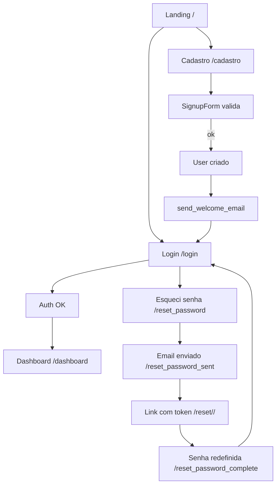
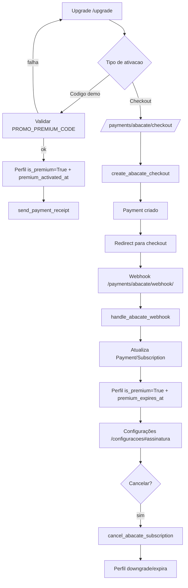

# Synex Study Flow - Documentacao Tecnica

Data de referencia: 2026-01-30

Este documento descreve a arquitetura, modulos, funcoes, views, templates e integracoes do projeto Synex Study Flow (Django).

## 1) Visao geral do sistema

O Synex Study Flow e uma plataforma web de organizacao de estudos com:
- Kanban de tarefas
- Dashboard com KPIs e graficos
- Cronograma (calendario) de entregas e estudos
- Modo foco (cronometro)
- Cadernos de anotacoes (com Markdown e tags)
- Metas e materias
- Assinatura Premium (Abacate Pay)
- Feedback do usuario
- PWA (service worker + manifest)

Arquitetura principal:
- Backend: Django 6.0
- Banco: PostgreSQL
- Frontend: templates Django + Tailwind CDN + JS custom
- Deploy: Docker + Gunicorn + Whitenoise

## 2) Estrutura de pastas

- `config/`: configuracao do projeto Django
- `core/`: app principal (models, views, forms, templates, static, pagamentos, emails)
- `media/`: uploads (avatars)
- `staticfiles/`: static coletado (collectstatic)
- `venv/`: ambiente virtual local
- `Dockerfile`, `docker-compose.yml`, `entrypoint.sh`: deploy local e container

## 3) Dependencias principais (requirements.txt)

- Django 6.0
- psycopg2-binary (PostgreSQL)
- whitenoise (static)
- django-taggit (tags de anotacoes)
- Markdown + bleach (render seguro de markdown)
- pillow (validacao de imagem avatar)
- gunicorn (servidor WSGI)

## 4) Configuracoes do projeto (config/settings.py)

### 4.1 Variaveis de ambiente

Obrigatorias (producao):
- `SECRET_KEY`
- `ALLOWED_HOSTS` (lista separada por virgula)

Banco:
- `USE_POSTGRES` (default True)
- `DB_NAME`, `DB_USER`, `DB_PASSWORD`, `DB_HOST`, `DB_PORT`
- `DATABASE_URL` (se definido, sobrescreve config do banco; usado no Render)

Seguranca/HTTP:
- `DEBUG` (default False)
- `CSRF_TRUSTED_ORIGINS` (lista por virgula)
- `SECURE_SSL_REDIRECT`, `SESSION_COOKIE_SECURE`, `CSRF_COOKIE_SECURE`

Email:
- `EMAIL_BACKEND`, `EMAIL_HOST`, `EMAIL_PORT`, `EMAIL_USE_TLS`
- `EMAIL_HOST_USER`, `EMAIL_HOST_PASSWORD`
- `DEFAULT_FROM_EMAIL`, `FEEDBACK_EMAIL_TO`

App/UX:
- `APP_VERSION` (default `0.075 beta`)
- `MAINTENANCE_MODE`, `MAINTENANCE_MESSAGE`, `MAINTENANCE_END_AT`

Premium (promo/demo):
- `PROMO_PREMIUM_CODE`, `PROMO_PREMIUM_DAYS`

Abacate Pay:
- `SITE_URL`
- `ABACATEPAY_API_URL`, `ABACATEPAY_TOKEN`, `ABACATEPAY_WEBHOOK_SECRET`
- `ABACATEPAY_CHECKOUT_PATH`, `ABACATEPAY_CANCEL_PATH`
- `ABACATEPAY_PIX_QRCODE_PATH`, `ABACATEPAY_PIX_SIMULATE_PATH`
- `ABACATEPAY_CURRENCY`, `ABACATEPAY_PREMIUM_PRICE_CENTS`
- `ABACATEPAY_ONE_TIME_PRICE_CENTS`, `ABACATEPAY_ONE_TIME_DAYS`
- `ABACATEPAY_SIMULATE_PIX`

### 4.2 Hosts e CSRF

- `ALLOWED_HOSTS` recebe domains do .env e adiciona manualmente:
  - `synexstudy.top`, `www.synexstudy.top`
- `CSRF_TRUSTED_ORIGINS` adiciona manualmente:
  - `https://synexstudy.top`, `https://www.synexstudy.top`, `http://www.synexstudy.top`

### 4.3 Static e Media

- `STATIC_URL = /static/`
- `STATIC_ROOT = staticfiles/` (collectstatic)
- `MEDIA_URL = /media/`
- `MEDIA_ROOT = media/`
- `whitenoise.storage.CompressedManifestStaticFilesStorage`

## 5) URLs principais

### 5.1 Projeto (config/urls.py)

- `/admin/` -> Django admin
- `/` -> include `core.urls`

### 5.2 App (core/urls.py)

Landing e auth:
- `/` e `/home` -> `landing_page`
- `/home/` -> `home_redirect`
- `/login/` -> `LoginView`
- `/logout/` -> `LogoutView`
- `/cadastro/` -> `cadastro`
- `/perfil/` -> `perfil_view`
- `/upgrade/` -> `upgrade_view`
- `/assinatura/` -> `assinatura_view`
- `/configuracoes/` -> `configuracoes_view`

Recuperacao de senha (Django auth views):
- `/reset_password/`
- `/reset_password_sent/`
- `/reset/<uidb64>/<token>/`
- `/reset_password_complete/`

Ferramentas:
- `/board/` -> `kanban_view`
- `/dashboard/` -> `dashboard_view`
- `/foco/` -> `foco_view`
- `/cronograma/` -> `cronograma_view`
- `/anotacoes/` -> `anotacoes_list`
- `/anotacoes/nova/` -> `anotacao_edit`
- `/anotacoes/editar/<id>/` -> `anotacao_edit`
- `/anotacoes/ler/<id>/` -> `anotacao_detail`
- `/anotacoes/excluir/<id>/` -> `anotacao_delete`
- `/metas/` -> `metas_list`
- `/metas/<id>/` -> `meta_detail`
- `/materias/` -> `materias_list`
- `/materias/delete/<id>/` -> `materia_delete`

APIs:
- `/api/mover/` -> `api_mover_tarefa`
- `/api/calendar/` -> `api_tarefas_calendar`
- `/api/calendar/study/` -> `api_study_calendar`
- `/api/favoritar/` -> `api_toggle_favorito`
- `/api/export/tarefas/` -> `api_export_tarefas`
- `/api/feedback/` -> `api_feedback`

Pagamentos:
- `/payments/abacate/checkout/` -> `abacate_checkout_view`
- `/payments/abacate/webhook/` -> `abacate_webhook`

PWA:
- `/sw.js` -> `service_worker`

Manutencao e legais:
- `/manutencao/` -> `manutencao_view`
- `/termos/` -> `termos_view`
- `/privacidade/` -> `privacidade_view`
- `/feedbacks/` -> `feedbacks_view` (staff only)

## 6) Models (core/models.py)

### 6.1 Materia
Campos:
- `usuario (FK User)`
- `nome`, `descricao`, `cor`, `created_at`
Regras:
- Unique: (usuario, nome)
Uso:
- Relaciona tarefas, sessoes e anotacoes.

### 6.2 Tarefa
Campos:
- `usuario`, `materia`, `titulo`, `descricao`, `status`, `prioridade`, `ordem`, `data_entrega`
- `meta` (FK MetaObjetivo)
Regras:
- Indices por (usuario, status, ordem) e (usuario, data_entrega)
- `clean()` valida materia/meta do mesmo usuario
Uso:
- Kanban, cronograma e dashboard.

### 6.3 Anotacao
Campos:
- `usuario`, `materia`, `titulo`, `conteudo`, `favorito`, `prioridade`, `fonte`, `tags`
Regras:
- Indices por usuario/materia, usuario/favorito, usuario/prioridade
- `clean()` valida materia do mesmo usuario
Uso:
- Cadernos com tags (django-taggit).

### 6.4 MetaObjetivo
Campos:
- `usuario`, `titulo`, `descricao`, `data_alvo`, `concluida`
Metodo:
- `progresso()` calcula percentual de tarefas concluidas.

### 6.5 SessaoEstudo
Campos:
- `usuario`, `materia`, `tarefa`, `duracao_min`, `data`
Regras:
- `duracao_min > 0` (CheckConstraint)
- Indice por (usuario, data)
- `clean()` valida materia/tarefa do mesmo usuario
Uso:
- Dashboard (horas/estudos).

### 6.6 Feedback
Campos:
- `usuario`, `rating`, `comment`, `page`, `created_at`
Uso:
- Coleta de feedback; lista de administracao.

### 6.7 Perfil
Campos:
- `usuario (OneToOne)`, `avatar`, `is_premium`, `premium_activated_at`, `premium_expires_at`
Metodo:
- `avatar_url()` retorna imagem ou SVG embutido.

### 6.8 Subscription
Campos:
- `usuario`, `provider`, `provider_id`, `status`, `amount_cents`, `currency`, `current_period_end`, `raw_payload`
Regras:
- Unique por (provider, provider_id) se provider_id nao vazio
- Indice por (usuario, status)

### 6.9 Payment
Campos:
- `usuario`, `subscription`, `provider`, `provider_id`, `kind`, `status`, `amount_cents`, `currency`, `checkout_url`, `raw_payload`
Regras:
- Unique por (provider, provider_id) se provider_id nao vazio
- Indice por (usuario, status)

### 6.10 Signals (models.py)
- `criar_perfil`: cria `Perfil` no `post_save` de `User`
- `salvar_perfil`: salva perfil existente no `post_save` de `User`

## 7) Forms (core/forms.py)

- `TarefaForm`: filtra materias do usuario logado
- `AnotacaoForm`: filtra materias do usuario logado
- `MetaForm`: cria metas
- `MateriaForm`: cria materias (com cor)
- `SessaoEstudoForm`: filtra materias/tarefas do usuario logado
- `PerfilForm`: valida avatar (tamanho <= 2MB, MIME e imagem valida)
- `SignupForm`: exige email unico e aceite de termos

## 8) Middleware (core/middleware.py)

- `SecurityHeadersMiddleware`: adiciona headers de seguranca (X-Content-Type-Options, X-Frame-Options, Referrer-Policy, Permissions-Policy, HSTS em HTTPS)
- `MaintenanceModeMiddleware`: redireciona para `/manutencao/` quando `MAINTENANCE_MODE=True`, exceto admin/static/media e staff

## 9) Context processors (core/context_processors.py)

- `_sync_premium(perfil)`: expira premium quando `premium_expires_at` ja passou
- `favoritos_globais(request)`: injeta no template
  - `sidebar_favoritos` (ultimos 5 favoritos)
  - `user_perfil` (perfil do usuario)
  - `onboarding_first_login` (flag de primeiro login via session)

## 10) Signals adicionais (core/signals.py)

- `mark_first_login`: no `user_logged_in`, marca `synex_first_login` na session se `last_login` for None

## 11) Admin (core/admin.py)

- `MateriaAdmin`, `TarefaAdmin`, `FeedbackAdmin`
- `Anotacao` registrado diretamente

## 12) Views e funcoes (core/views.py)

### 12.1 Helpers internos
- `_build_assinatura_context(user)`: monta dados de assinatura e historico de pagamentos

### 12.2 Views publicas
- `landing_page`: landing publica; se logado redireciona para dashboard
- `home_redirect`: redireciona para `/home`
- `termos_view`: render `termos.html`
- `privacidade_view`: render `privacidade.html`

### 12.3 Auth e perfil
- `cadastro`: cria usuario via `SignupForm`, envia email de boas-vindas
- `perfil_view`: edita avatar (upload)

### 12.4 Premium / pagamento
- `upgrade_view`: aplica codigo promo; ativa premium demo e envia recibo
- `assinatura_view`: redireciona para `configuracoes#assinatura`
- `abacate_checkout_view`: inicia checkout (subscription ou one_time) via Abacate Pay
- `abacate_webhook`: webhook Abacate Pay (CSRF exempt)
- `configuracoes_view`: permite cancelar assinatura e mostra dados (versao/app e historico)

### 12.5 Kanban
- `kanban_view`: lista tarefas por status; cria nova tarefa; limita plano free (3 tarefas)
- `api_mover_tarefa` (POST JSON): atualiza status da tarefa

### 12.6 Anotacoes
- `anotacoes_list`: lista, filtra por search e tag
- `anotacao_edit`: cria/edita anotacao
- `anotacao_detail`: renderiza Markdown e sanitiza com bleach
- `anotacao_delete`: exclui anotacao
- `api_toggle_favorito`: alterna favorito via JSON

### 12.7 Dashboard
- `dashboard_view`: KPIs de tarefas, produtividade semanal, metas, prazos e sessoes de estudo

### 12.8 Cronograma
- `cronograma_view`: render pagina de calendario
- `api_tarefas_calendar`:
  - GET: retorna eventos de tarefas com data
  - POST: atualiza data de entrega
- `api_study_calendar`:
  - GET: retorna eventos all-day com horas estudadas

### 12.9 Metas e materias
- `metas_list`: cria/lista metas
- `meta_detail`: mostra meta e tarefas vinculadas
- `materias_list`: cria/lista materias
- `materia_delete`: exclui materia

### 12.10 Exportacao e feedback
- `api_export_tarefas`: exporta tarefas (Premium apenas)
- `api_feedback`: recebe feedback (JSON ou POST), valida rating e tamanho, salva e envia email
- `feedbacks_view`: lista feedbacks (somente staff)

### 12.11 PWA e manutencao
- `service_worker`: entrega `core/static/core/sw.js` com header Service-Worker-Allowed
- `manutencao_view`: pagina de manutencao se flag ativa

## 13) Pagamentos Abacate Pay (core/payments.py)

Funcoes internas:
- `_get_setting`, `_api_post`, `_is_simulation_enabled`, `_parse_timestamp`
- `_mark_premium_for_one_time`: ativa premium com expiracao
- `_create_pix_qrcode`: cria QRCode PIX
- `_simulate_pix_payment`: simula pagamento PIX (dev)
- `_normalize_status`: normaliza status do provider
- `_verify_signature`: valida webhook (HMAC)

Fluxos:
- `create_abacate_checkout`: cria checkout; para one_time usa simulacao PIX; para subscription salva Payment/Subscription
- `cancel_abacate_subscription`: chama API e marca como canceled
- `handle_abacate_webhook`: atualiza Payment/Subscription e sincroniza perfil premium

## 14) Emails (core/emails.py)

- `send_welcome_email`: boas-vindas
- `send_engagement_nudge`: lembra prazos/inatividade
- `send_payment_receipt`: recibo de pagamento
- `send_cancellation_email`: cancelamento
- `send_trial_reminder`: fim do trial
- `get_users_needing_engagement`: usuarios com tarefas proximas e/ou inativos
- `build_engagement_payload`: monta dados do nudge

## 15) Templates (core/templates/core)

Principais paginas:
- `base.html`: layout principal, sidebar, modais (cmdk, feedback), configs JS e theme
- `landing.html`: landing publica
- `login.html`, `cadastro.html`: autenticacao
- `dashboard.html`: KPIs e graficos
- `kanban.html`: quadro de tarefas
- `cronograma.html`: calendario (tarefas e estudos)
- `foco.html`: modo foco
- `materias_list.html`: CRUD de materias
- `metas_list.html`, `meta_detail.html`: metas
- `anotacoes_list.html`, `anotacao_form.html`, `anotacao_detail.html`: cadernos
- `perfil.html`: avatar
- `configuracoes.html`: conta e assinatura
- `upgrade.html`: pagina de upgrade/promo
- `assinatura.html`: historico de pagamentos (pagina dedicada)
- `feedbacks.html`: lista de feedbacks (staff)
- `manutencao.html`, `termos.html`, `privacidade.html`: paginas auxiliares
- `partials/card_tarefa.html`: componente de tarefa

## 15.1) Detalhamento por template (secoes/IDs principais)

`core/templates/core/base.html`
- Estrutura base (sidebar + header + conteudo principal) e modais globais
- IDs/chaves usadas pelo JS: `#sidebar-toggle`, `#profile-menu-toggle`, `#profile-menu`, `#cmdk`, `#cmdk-backdrop`, `#cmdk-input`, `#cmdk-list`, `#focus-clock`, `#focus-clock-time`, `#focus-clock-toggle`, `#focus-clock-reset`, `#feedback-open`, `#feedback-modal`, `#feedback-backdrop`, `#feedback-form`, `#feedback-stars`, `#feedback-rating`, `#feedback-comment`, `#feedback-submit`, `#global-toast`
- Config global JS: `window.SYNEX_CONFIG` com URLs e seletores

`core/templates/core/landing.html`
- Landing publica com seções: navbar, hero, features, pricing, FAQ, CTA final, footer
- IDs de ancora: `#features`, `#pricing`, `#faq`, `#legal`
- Service worker registrado no load

`core/templates/core/login.html`
- Layout split (marketing + card de login)
- Form Django auth com mensagens e erros

`core/templates/core/cadastro.html`
- Layout split com form de cadastro
- Checkbox de termos (campo `terms_accepted`) e help_text com links legais

`core/templates/core/dashboard.html`
- KPIs, graficos (Chart.js), proximos prazos e cards de estudo
- IDs: `#productivityChart`, `#materiaChart`, `#studyChart`, `#timer-display`, `#timer-start`, `#timer-stop`, `#timer-overlay`, `#overlay-timer`, `#overlay-stop`, `#overlay-close`, `#add-1`, `#add-5`, `#add-10`, `#sessao-form`, `#export-btn`, `#export-status`, `#water-reminder-toggle`, `#water-reminder-status`

`core/templates/core/kanban.html`
- Quadro kanban (desktop) + tabs mobile
- Colunas com `data-status` e listas: `#todo-list`, `#doing-list`, `#review-list`, `#done-list`
- Modal de nova tarefa: `#modal-nova-tarefa`
- Toast local: `#kanban-toast`
- JS: SortableJS + fetch em `/api/mover/`

`core/templates/core/cronograma.html`
- FullCalendar + custom event rendering
- Container do calendario: `#calendar`
- API: GET/POST em `/api/calendar/` (arrastar/soltar)

`core/templates/core/foco.html`
- Timer pomodoro com modos (pomodoro/short/long)
- IDs: `#timer-display`, `#progress-bar`, `#btn-pomodoro`, `#btn-short`, `#btn-long`, `#btn-action`, `#status-text`

`core/templates/core/materias_list.html`
- Grid de materias + modal de cadastro
- Modal: `#modal-materia` (abre/fecha via JS)
- Radio custom de cores com `.color-swatch`

`core/templates/core/metas_list.html`
- Cards de metas com progresso e link para detalhe
- Modal: `#modal-meta`

`core/templates/core/meta_detail.html`
- Header da meta, barra de progresso e lista de tarefas vinculadas
- Acoes rapidas movem tarefa via `/api/mover/`

`core/templates/core/anotacoes_list.html`
- Grid de cards com busca e tags
- Botao favorito chama `/api/favoritar/` via JS

`core/templates/core/anotacao_form.html`
- Form com EasyMDE (Markdown)
- Editor ligado ao textarea `#id_conteudo`
- Form ID: `#form-anotacao`

`core/templates/core/anotacao_detail.html`
- Render Markdown sanitizado + highlight.js
- Links para editar/excluir e fonte externa

`core/templates/core/perfil.html`
- Upload de avatar com preview
- IDs: `#id_avatar`, `#avatar-preview`, `#avatar-fallback`

`core/templates/core/configuracoes.html`
- Cards de preferencias, assinatura, install PWA e onboarding
- IDs: `#theme-toggle-inline`, `#theme-status`, `#onboarding-reset`
- Secao ancora: `#assinatura`

`core/templates/core/upgrade.html`
- Ativacao demo (codigo) + checkout Abacate Pay
- Forms: `/payments/abacate/checkout/` (subscription e one_time)

`core/templates/core/assinatura.html`
- Status e historico (modo demo)

`core/templates/core/feedbacks.html`
- Tabela de feedbacks (staff-only)

`core/templates/core/manutencao.html`
- Pagina standalone com contagem regressiva
- IDs: `#timer`, `#end-at` (dados via `maintenance_end_at`)

`core/templates/core/termos.html` e `privacidade.html`
- Paginas legais standalone (Bootstrap) com texto resumido

`core/templates/core/password_reset*.html`
- Fluxo completo de reset de senha: request, sent, confirm e complete

`core/templates/core/partials/card_tarefa.html`
- Card compacto de tarefa (usado em Kanban)
- Badge de status via `data-status-badge`

## 16) Static e JS (core/static/core)

- `app_novo.js`: JS principal
  - theme toggle
  - onboarding (fluxo guiado)
  - sidebar collapse
  - menu perfil
  - cmdk (atalhos Ctrl+K)
  - focus clock (timer flutuante, persistente)
  - modal de feedback (POST JSON para `/api/feedback/`)
- `app.min.js`: legado/minificado
- `manifest.json`: PWA
- `sw.js`: service worker
- `icons/icon.svg`: icone

## 17) PWA

- `manifest.json` registrado em `base.html`
- `service_worker` servido em `/sw.js`

## 18) Docker e deploy

`Dockerfile`:
- Python 3.12-slim
- instala dependencias
- executa `entrypoint.sh`

`entrypoint.sh`:
- `migrate`, `collectstatic`, depois `gunicorn`

`docker-compose.yml`:
- `web`: Django + gunicorn (porta 8000)
- `db`: Postgres 16
- `backup`: dump diario com retenção 7 dias
- `pgadmin`: admin visual

## 19) Testes (core/tests.py)

- `SignupFormTests`: valida termos obrigatorios e email unico
- `KanbanLimitsTests`: limite de 3 tarefas no plano free

## 20) Pontos de seguranca e observacoes

- Webhook Abacate Pay valida assinatura HMAC
- Limite de tarefas free (3)
- Renderizacao de Markdown sanitizada com bleach
- `MaintenanceModeMiddleware` bloqueia acesso geral quando ativo
- CSRF e cookies seguros configuraveis por env

## 21) Mapas rapidos (referencias de codigo)

- Config: `config/settings.py`
- URLs: `config/urls.py`, `core/urls.py`
- Views: `core/views.py`
- Models: `core/models.py`
- Forms: `core/forms.py`
- Payments: `core/payments.py`
- Emails: `core/emails.py`
- Middleware: `core/middleware.py`
- Context: `core/context_processors.py`
- Signals: `core/signals.py`
- Templates: `core/templates/core/`
- Static: `core/static/core/`

## 22) Diagramas de fluxo (Mermaid)

### 22.1) Auth (cadastro, login e reset)



### 22.2) Premium (promo e checkout Abacate Pay)



### 22.3) Cronograma (FullCalendar)

```mermaid
flowchart TD
    A[Cronograma /cronograma] --> B[FullCalendar render]
    B --> C[GET /api/calendar]
    C --> D[Eventos de tarefas]
    D --> B
    B --> E[Drag/Drop evento]
    E --> F[POST /api/calendar {id, data}]
    F --> G[Tarefa atualizada]
    G --> B
```

## 23) Mapa de endpoints (metodo, payload, resposta, permissoes)

Legenda de permissoes:
- Publico: sem login
- Autenticado: requer login
- Staff: requer `is_staff`

### 23.1) Paginas publicas e autenticacao

| Endpoint | Metodo | Payload | Resposta | Permissoes |
| --- | --- | --- | --- | --- |
| `/` | GET | - | HTML (landing) | Publico |
| `/home` | GET | - | HTML (landing) | Publico |
| `/home/` | GET | - | Redirect -> `/home` | Publico |
| `/login/` | GET/POST | Credenciais (form Django) | HTML/Redirect | Publico |
| `/logout/` | POST | CSRF | Redirect | Autenticado |
| `/cadastro/` | GET/POST | SignupForm (username, email, senha, terms) | HTML/Redirect | Publico |
| `/reset_password/` | GET/POST | Email | HTML/Redirect | Publico |
| `/reset_password_sent/` | GET | - | HTML | Publico |
| `/reset/<uidb64>/<token>/` | GET/POST | Nova senha | HTML/Redirect | Publico |
| `/reset_password_complete/` | GET | - | HTML | Publico |
| `/termos/` | GET | - | HTML | Publico |
| `/privacidade/` | GET | - | HTML | Publico |

### 23.2) App autenticado (HTML)

| Endpoint | Metodo | Payload | Resposta | Permissoes |
| --- | --- | --- | --- | --- |
| `/dashboard/` | GET/POST | SessaoEstudoForm | HTML | Autenticado |
| `/board/` | GET/POST | TarefaForm | HTML | Autenticado |
| `/cronograma/` | GET | - | HTML | Autenticado |
| `/foco/` | GET | - | HTML | Autenticado |
| `/anotacoes/` | GET | `q`, `tag` (query) | HTML | Autenticado |
| `/anotacoes/nova/` | GET/POST | AnotacaoForm | HTML/Redirect | Autenticado |
| `/anotacoes/editar/<id>/` | GET/POST | AnotacaoForm | HTML/Redirect | Autenticado |
| `/anotacoes/ler/<id>/` | GET | - | HTML | Autenticado |
| `/anotacoes/excluir/<id>/` | POST | CSRF | Redirect | Autenticado |
| `/metas/` | GET/POST | MetaForm | HTML | Autenticado |
| `/metas/<id>/` | GET | - | HTML | Autenticado |
| `/materias/` | GET/POST | MateriaForm | HTML | Autenticado |
| `/materias/delete/<id>/` | POST | CSRF | Redirect | Autenticado |
| `/perfil/` | GET/POST | PerfilForm (avatar) | HTML/Redirect | Autenticado |
| `/configuracoes/` | GET/POST | `action=cancel` (form) | HTML/Redirect | Autenticado |
| `/upgrade/` | GET/POST | `code` (promo) | HTML/Redirect | Autenticado |
| `/assinatura/` | GET | - | Redirect -> `/configuracoes#assinatura` | Autenticado |
| `/feedbacks/` | GET | - | HTML | Staff |
| `/manutencao/` | GET | - | HTML | Publico (mostra se MAINTENANCE_MODE) |

### 23.3) APIs (JSON)

| Endpoint | Metodo | Payload | Resposta | Permissoes |
| --- | --- | --- | --- | --- |
| `/api/mover/` | POST | JSON `{id, status}` | JSON `{success, message?}` | Autenticado |
| `/api/calendar/` | GET | - | JSON `[eventos]` | Autenticado |
| `/api/calendar/` | POST | JSON `{id, data}` | JSON `{success}` | Autenticado |
| `/api/calendar/study/` | GET | - | JSON `[eventos]` | Autenticado |
| `/api/favoritar/` | POST | JSON `{id}` | JSON `{success, is_favorito}` | Autenticado |
| `/api/export/tarefas/` | GET | - | JSON `[tarefas]` ou 403 | Autenticado (Premium) |
| `/api/feedback/` | POST | JSON `{rating, comment, page}` ou form | JSON `{success}` | Autenticado |

### 23.4) Pagamentos (Abacate Pay)

| Endpoint | Metodo | Payload | Resposta | Permissoes |
| --- | --- | --- | --- | --- |
| `/payments/abacate/checkout/` | POST | `kind=subscription|one_time` | Redirect para checkout ou redirect interno | Autenticado |
| `/payments/abacate/webhook/` | POST | JSON do provider + assinatura | JSON `{success, message}` | Publico (valida HMAC) |

### 23.5) PWA

| Endpoint | Metodo | Payload | Resposta | Permissoes |
| --- | --- | --- | --- | --- |
| `/sw.js` | GET | - | JS (service worker) | Publico |

---
